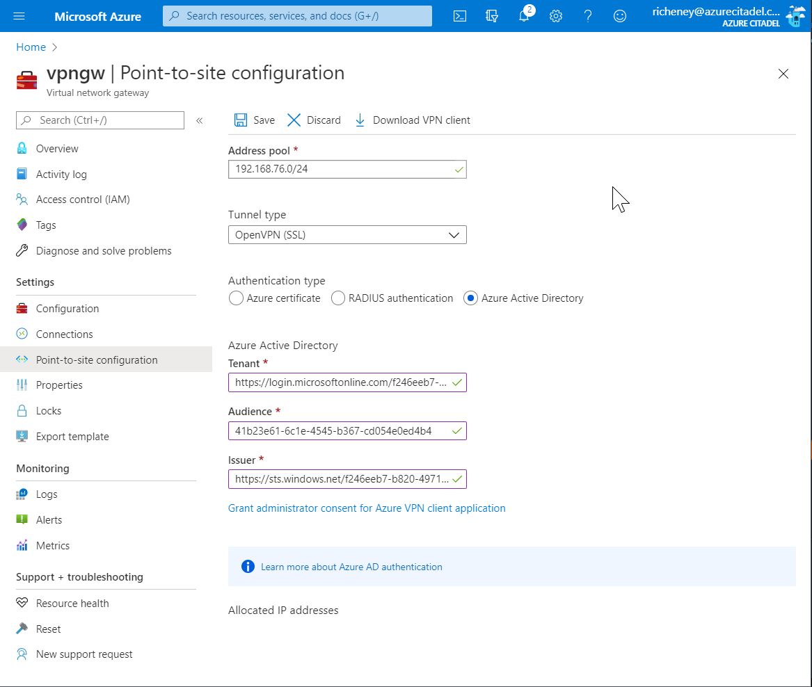
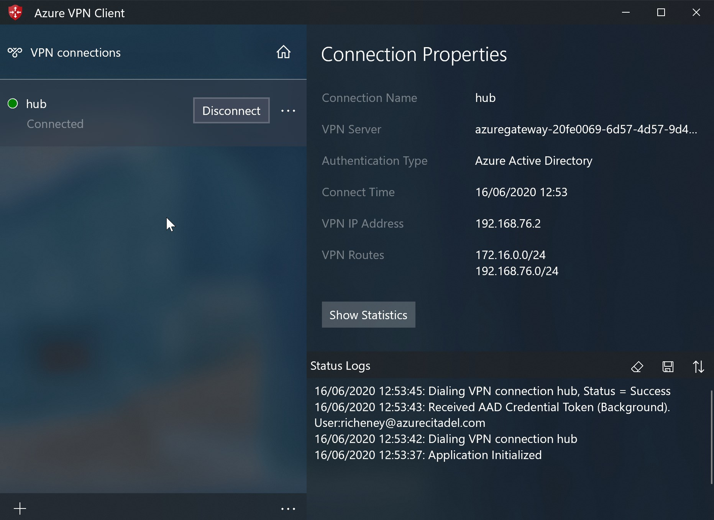

# VPN Gateway config

## Overview

The VPN Gateway will build with the P2S settings in the example terraform.tfvars, but needs additional config for Azure Active Directory support. AAD auth is not supported in the Terraform provider today.

This readme will cover the additional steps required. It assumes you are using Ubuntu.

## References

* <https://docs.microsoft.com/azure/vpn-gateway/>
* <https://docs.microsoft.com/azure/vpn-gateway/openvpn-azure-ad-tenant>
* <https://docs.microsoft.com/azure/vpn-gateway/vpn-gateway-certificates-point-to-site-linux>

* <https://aka.ms/terraform>
* <https://www.terraform.io/docs/providers/azurerm/r/virtual_network_gateway.html>
* <https://github.com/terraform-providers/terraform-provider-azurerm/issues/6805>

## Create a self signed cert

This should be a one off task per site. If you have access to a proper cert then you can use that instead.

1. Install the pre-reqs:

    ```bash
    sudo apt install strongswan strongswan-pki libstrongswan-extra-plugins
    ```

1. Create the key in PEM format:

    ```bash
    ipsec pki --gen --outform pem > caKey.pem
    ```

1. Create the certificate in PEM format:

    ```bash
    ipsec pki --self --in caKey.pem --dn "CN=VPN CA" --ca --outform pem > caCert.pem
    ```

1. Convert the certificate to base64 encoded X.509 format, 64 characters wide:

    ```bash
    openssl x509 -in caCert.pem -outform der | base64 -w64 > base64_x509_caCert.pem
    ```

You will need to retain the caCert.pem, caKey.pem and base64_x509_caCert.pem files.

An example .pem file is included in the repo for comparison, or for test/dev use.

## Update Terraform config

This config has four variables for the vpn_client_configuration block. All are defaulted:

```terraform
variable "vpn_client" {
  description = "Boolean to control creation of vpn_client_configuration block."
  type        = bool
  default     = false
}

variable "vpn_client_address_space" {
  description = "List of address spaces for the vpn client."
  type        = list(string)
  default     = ["192.168.76.0/24"]
}

variable "vpn_client_cert" {
  description = "Base 64 encoded X.509 PEM cert."
  type        = string
  default     = "base64_x509_caCert.pem"
}

variable "vpn_client_cert_name" {
  description = "Description for the root cert."
  type        = string
  default     = "SelfSignedCertificate"
}
```

1. Set `vpn_client = true` in terraform.tfvars

    This will use the other defaults in the dynamically generated block. Override them if required.

1. Run through Terraform fmt, validate, plan and apply

    The VPN gateway will take 30-60 minutes to build.

1. List the output

    An output has been created to make the next step simpler.

    ```bash
    terraform output vpn_client
    ```

    Example output

    ```terraform
    {
      "address_space" = [
        "192.168.76.0/24",
      ]
      "authentication_type" = "Azure Active Directory"
      "azure_active_directory" = {
        "audience" = "41b23e61-6c1e-4545-b367-cd054e0ed4b4"
        "issuer" = "https://sts.windows.net/f246eeb7-b820-4971-a083-9e100e084ed0/"
        "tenant" = "https://login.microsoftonline.com/f246eeb7-b820-4971-a083-9e100e084ed0/"
      }
      "vpn_client_protocols" = [
        "OpenVPN",
      ]
    }
    ```

## Modify the P2S config in the portal

The Terraform provider does not yet have the ability to configure AAD, so the following have to be done manually. Note that future Terraform plans will not revert any of these changes. (Needs to be reassessed once support for AAD P2S is added to the provider.)

1. Open the [Azure Portal](https://portal.azure.com)
1. Open the VPN Gateway resource and select Point-to-site Configuration in the blade
1. Change the Authentication Type radio button to Azure Active Directory
1. Add the strings from the previous step's output to configure Tenant, Audience and Issuer

    

    > Note that the trailing slahes are important for the Tenant and Issuer URIs

1. Click on **Save**

1. Click on the **Grant administrator consent for Azure VPN client application** link
1. Authenticate as an account with Global Admin role in AAD

    > This access grant should be a one off requirement per tenancy, and once completed you will see Azure VPN listed in Enterprise Apps.

## Generate the VPN client config files

Generate a zip file containing config files for different VPN clients, and then extract the required one for the Azure VPN client.

1. Set the resource group variable

    ```bash
    resource_group_name=hub
    ```

1. Generate the vpn_client zip

    ```bash
    subscription_id=$(az account show --query id --output tsv)
    vpngw_name=$(az network vnet-gateway list --resource-group $resource_group_name --query "[0].name" --output tsv)
    echo "az network vnet-gateway vpn-client generate --name $vpngw_name --processor-architecture X86 --resource-group $resource_group_name --subscription $subscription_id --authentication-method EAPTLS --output tsv"
    az network vnet-gateway vpn-client generate --name $vpngw_name --processor-architecture X86 --resource-group $resource_group_name --subscription $subscription_id --authentication-method EAPTLS --output tsv
    ```

1. Open the URL from the last command in your browser to download the zip file

    > The zip will usually contain files for AzureVPN, Generic and OpenVPN. As AAD is the auth method then only the first two will work.

1. Extract the AzureVPN/azurevpnconfig.xml file to Downloads

    > This file may be safely shared with other users as they will have to authenticate to AAD

## Azure VPN client

1. Download and then open the [Azure VPN](https://go.microsoft.com/fwlink/?linkid=2117554) client
1. Click on **+** and then **Import** (or use `CTRL`+`I`)
1. Select the azurevpnconfig.xml file in your Downloads folder
1. Save
1. Click on Connect and then authenticate in the dialog box



## Native Windows 10 Systray connectivity

Once the connection is established then you can reconnect in future either via the app or you can use the network icon in the systray.


